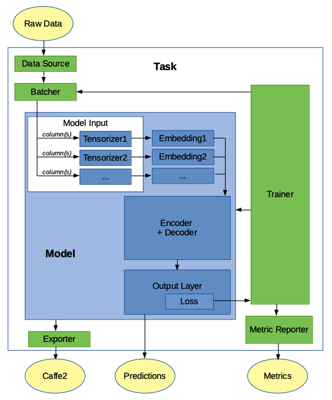

Architecture Overview
======================

PyText is designed to help users build end to end pipelines for training and inference. A number of default pipelines are implemented for popular tasks which can be used as-is. Users are free to extend or replace one or more of the pipelines's components.

The following figure describes the relationship between the major components of PyText:

Note: some models might implement a single "encoder_decoder" component while others implement two components: a representation and a decoder.

Model
-----

The Model class is the central concept in PyText. It defines the neural network architecture. PyText provides models for common NLP jobs. Users can implement their custom model in two ways:

- subclassing :class:`~Model` will give you most of the functions for the common architecture `embedding -> representation -> decoder -> output_layer`.

- if you need more flexibility, you can subclass the more basic :class:`~BaseModel` which makes no assumptions about architectures, allowing you to implement any model.

Most PyText models implement :class:`~Model` and use the following architecture:

.. code-block:: console

  - model
    - model_input
      - tensorizers
    - embeddings
    - encoder+decoder
    - output_layer
      - loss
      - prediction

- **model_input**: defines how the input strings will be transformed into tensors. This is done by input-specific "Tensorizers". For example, the :class:`~TokenTensorizer` takes a sentence, tokenize it and looks up in its vocabulary to create the corresponding tensor. (The vocabulary is created during initialization by doing a first pass on the inputs.) In addition to the inputs, we also define here how to handle other data that can be found in the input files, such as the "labels" (arguably an output, but true labels are used an input during training).

- **embeddings**: this step transforms the tensors created by model_input into embeddings. Each model_input (tensorizer) will be associated to a compatible embedding class (for example: :class:`~WordEmbedding`, or :class:`~CharacterEmbedding`). (see `pytext/models/embeddings/`)

- **representation**: also called "encoder", this can be one of the provided classes, such as those using a CNN (for example :class:`~DocNNRepresentation`), those using an LSTM (for example :class:`~BiLSTMDocAttention`), or any other type of representation. The parameters will depend on the representation selected. (see `pytext/models/representations/`)

- **decoder**: this is typically an MLP (Multi-Layer Perceptron). If you use the default :class:`~MLPDecoder`, `hidden_dims` is the most useful parameter, which is an array containing the number of nodes in each hidden layer. (see `pytext/models/decoders/`)

- **output_layer**: this is where the human-understandable output of the model is defined. For example, a document classification can automatically use the "labels" vocabulary defined in model_input as outputs. output_layer also defines the loss function to use during training. (see `pytext/models/output_layers/`)

Task: training definition
-------------------------

To train the model, we define a :class:`~Task`, which will tell PyText how to load the data, which model to use, how to train it, as well as the how to measure metrics.

The Task is defined with the following information:

- **data**: defines where to find and how to handle the data: see **data_source** and **batcher**.

- **data -> data_source**: The format of the input data (training, eval and testing) can differ a lot depending on the source. PyText provides :class:`~TSVDataSource` to read from the common tab-separated files. Users can easily write their own custom implementation if their files have a different format.

- **data -> batcher**: The batcher is responsible for grouping the input data into batches that will be processed one at a time. `train_batch_size`, `eval_batch_size` and `test_batch_size` can be changed to reduce the running time (while increasing the memory requirements). The default :class:`~Batcher` takes the input sequentially, which is adequat in most cases. Alternatively, `PoolingBatcher` shuffles the inputs to make sure the data is not in order, which could introduce a biais in the results.

- **trainer**: This defines a number of useful options for the training runs, like number of `epochs`, whether to `report_train_metrics` only during eval, and the `random_seed` to use.

- **metric_reporter**: different models will need to report different metrics. (For example, common metrics for document classification are precision, recall, f1 score.) Each PyText task can use a corresponding default metric reporter class, but users might want to use alternatives or implement their own.

- **exporter**: defines how to export the model so it can be used in production. PyText currently exports to caffe2 via onnx or torchscript.

- **model**: (see above)

How Data is Consumed
--------------------

#. **data_source**: Defines where the data can be found (for example: one training file, one eval file, and one test file) and the schema (field names). The data_source class will read each entry one by one (for example: each line in a TSV file) and convert each one into a **row**, which is a python dict of field name to entry value. Values are converted automatically if their type is specified.

#. **tensorizer**: Defines how **rows** are transformed into tensors. Tensorizers listed in the model will use one or more fields in the **row** to create a tensor or a tuple of tensors. To do that, some tensorizers will split the field values using a tokenizer that can be overridden in the config. Tensorizers typically have a vocabulary that allows them to map words or labels to numbers, and it's built during the initialization phase by scanning the data once. (Alternatively, it can be loaded from file.)

#. **model -> arrange_model_inputs()**: At this point, we have a python dict of tensorizer name to tensor or a tuple of tensors. Model has the method arrange_model_inputs() which flattens this python dict into a list tensors or tuple of tensors in the right order for the Model's forward method.

#. **model -> forward()**: This is where the magic happens. Input tensors are passed to the embbedings forward methods, then the results are passed to the encoder/decoder forward methods, and finally the ouput layer produces a prediction.

Config Example
--------------

We only specify the options we want to override. Everything else will use the default values. A typical config might look like this:

.. code-block:: console

  {
    "task": {
      "MyTask": {
        "data": {
          "source": {
            "TSVDataSource": {
              "field_names": ["label", "slots", "text"],
              "train_filename": "data/my_train_data.tsv",
              "test_filename": "data/my_test_data.tsv",
              "eval_filename": "data/my_eval_data.tsv"
            }
          }
        }
      }
    }
  }

Code Example
------------

.. code:: python

  class MyTask(NewTask):
      class Config(NewTask.Config):
          model: MyModel.Config = MyModel.Config()

  class MyModel(Model):
      class Config(Model.Config):
          class ModelInput(Model.Config.ModelInput):
              tokens: TokenTensorizer.Config = TokenTensorizer.Config()
              labels: SlotLabelTensorizer.Config = SlotLabelTensorizer.Config()

          inputs: ModelInput = ModelInput()
          embedding: WordEmbedding.Config = WordEmbedding.Config()

          representation: Union[
              BiLSTMSlotAttention.Config,
              BSeqCNNRepresentation.Config,
              PassThroughRepresentation.Config,
          ] = BiLSTMSlotAttention.Config()
          output_layer: Union[
              WordTaggingOutputLayer.Config, CRFOutputLayer.Config
          ] = WordTaggingOutputLayer.Config()
          decoder: MLPDecoder.Config = MLPDecoder.Config()

      @classmethod
      def from_config(cls, config, tensorizers):
          vocab = tensorizers["tokens"].vocab
          embedding = create_module(config.embedding, vocab=vocab)

          labels = tensorizers["labels"].vocab
          representation = create_module(
              config.representation, embed_dim=embedding.embedding_dim
          )
          decoder = create_module(
              config.decoder,
              in_dim=representation.representation_dim,
              out_dim=len(labels),
          )
          output_layer = create_module(config.output_layer, labels=labels)
          return cls(embedding, representation, decoder, output_layer)

      def arrange_model_inputs(self, tensor_dict):
          tokens, seq_lens, _ = tensor_dict["tokens"]
          return (tokens, seq_lens)

      def arrange_targets(self, tensor_dict):
          return tensor_dict["labels"]

      def forward(
          self,
          tokens: torch.Tensor,
      ) -> List[torch.Tensor]:
          embeddings = [self.token_embedding(tokens)]

          final_embedding = torch.cat(embeddings, -1)
          representation = self.representation(final_embedding)

          return self.decoder(representation)
