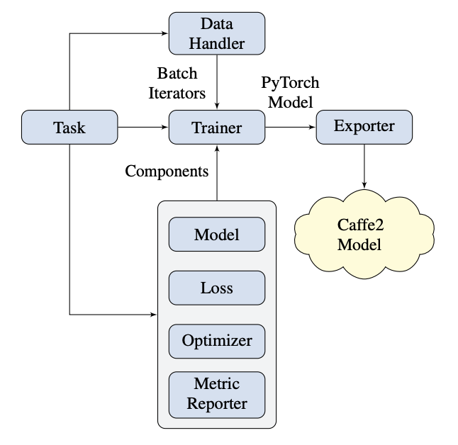

Architecture Overview
======================

PyText is designed to help users build end to end pipelines for training and inference. A number of default pipelines are implemented for popular tasks which can be used as-is. Users are free to implement one or more of the pipeline's components.

The following figure describes the relationship between the major components of PyText:

- **Task** combines various components required for a training or inference task into a pipeline. Conceptually, it is the central place to describe the components that are required for the given task and how to configure them.

- **Data Handler** processes raw input data and prepare batches of tensors to feed to the model. PyText provides a number of data handlers for different tasks. However if the input data requires custom processing for a task, then this is a component that the user must implement.

- **Model** defines the neural network architecture. PyText provides models for common tasks. For new models, users would need implement this component. Read the documentation of the class :class:`~Model` for more details on how to compose a new model.

- **Loss** defines how the loss should be computed for a given model logit and the true label/target. Making :class:`~Loss` a separate component allows us to swap loss functions without touching any other parts of the pipeline.

- **Optimizer** and **Scheduler** are responsible for model parameter optimization and learning rate scheduling. Typical users wouldn't need to implement this component. They should only configure these components to control the training process.

- **Metric Reporter** implements the relevant metric computation and reporting for the models. Just like :class:`~Model` and :class:`~Data Handler` if the current set of metric reporters don't work for a user then a new metric reporter with custom logic should be implemented.

- **Trainer** uses the data handler, model, loss, optimizer and scheduler to train a model and perform model selection by validating against a holdout set.

- **Predictor** uses the data handler and model for inference against given a test dataset.

- **Exporter** exports a trained PyTorch model to a Caffe2 net using `ONNX <https://onnx.ai/>`_.

Training Flow
-----------------------------

1. The `Task` is prepared by composing all the required components, and then training job is launched.

.. code-block:: python

	def train_model(
		config: PyTextConfig,
		dist_init_url: str = None,
		device_id: int = 0,
		rank: int = 0,
		world_size: int = 1,
	) -> Tuple:
		task = prepare_task(config, dist_init_url, device_id, rank, world_size)
		trained_model, best_metric = task.train(config, rank, world_size)
		# Only rank 0 gets to finalize the job and export the model
		if rank == 0:
			save_and_export(config, task)
		return trained_model, best_metric

The `Task` is a component itself and can be created using the factory function provided by PyText.

.. code-block:: python

	def create_task(task_config, metadata=None, model_state=None):
		return create_component(ComponentType.TASK, task_config, metadata, model_state)

2. The Training phase is split into two distinct parts:

Model training

.. code-block:: python

	for epoch in range(1, self.config.epochs + 1):
		print(f"Rank {rank} worker: Starting epoch #{epoch}")
		model.train()
		lrs = (str(lr) for lr in learning_rates(optimizers))
		print(f"Learning rate(s): {', '.join(lrs)}")

		self._run_epoch(
				Stage.TRAIN,
				epoch,
				train_iter,       # Passed by task.
				model,            # Passed by task.
				metric_reporter,  # Passed by task.
				pre_batch=training_pre_batch_callback,
				backprop=training_backprop,
				rank=rank,
		)

Model selection

.. code-block:: python

	for epoch in range(1, self.config.epochs + 1):
		# ...continuing from above above

		model.eval(Stage.EVAL)
		eval_metric = self._run_epoch(
			Stage.EVAL,
			epoch,
			eval_iter,        # Passed by task.
			model,            # Passed by task.
			metric_reporter,  # Passed by task.
			rank=rank
		)

		# Step the learning rate scheduler(s)
		if scheduler:
			assert eval_metric is not None
			scheduler.step(
				metrics=metric_reporter.get_model_select_metric(eval_metric),
				epoch=epoch,
			)

		# Choose best model.
		if metric_reporter.compare_metric(eval_metric, best_metric):
			print(f"Rank {rank} worker: Found a better model! Saving the model state.")
			last_best_epoch = epoch
			best_metric = eval_metric
			# Only rank = 0 trainer saves modules.
			if train_config.save_module_checkpoints and rank == 0:
				model.save_modules(
					base_path=train_config.modules_save_dir, suffix=f"-ep{epoch}"
				)
			# Save best model's state.
			best_model_state = copy.deepcopy(model.state_dict())
