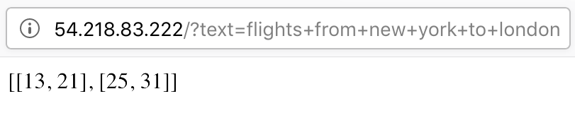
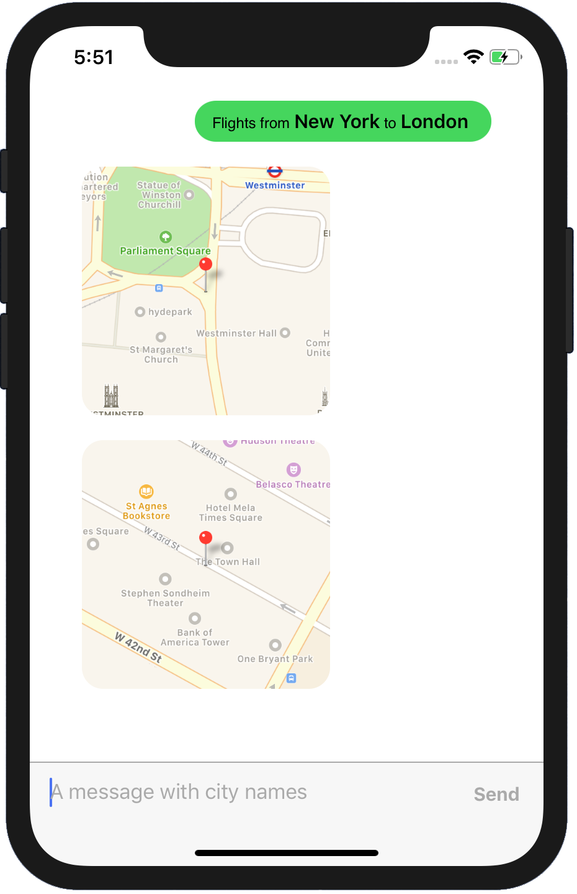

Using PyText models in your app
======================================================

Once you have a PyText model exported to Caffe2, you can host it on a simple web server in the cloud. Then your applications (web/mobile) can make requests to this server and use the returned predictions from the model.

In this tutorial, we'll take the intent-slot model that we trained `previously <atis_tutorial.html>`_ using the ATIS dataset, and host it on a `Flask <http://flask.pocoo.org/>`_ server running on an `Amazon EC2 <https://aws.amazon.com/ec2/>`_ instance. Then we'll write an iOS app which can identify city names in users' messages by querying the server.

1. Setup an EC2 instance
-------------------------

Amazon EC2 is a service which lets you host servers in the cloud for any arbitrary purpose. Use the official documentation to `sign up, create an IAM profile and a key pair <https://docs.aws.amazon.com/AWSEC2/latest/UserGuide/get-set-up-for-amazon-ec2.html>`_. Sign in into the EC2 Management Console and launch a new instance with the default Amazon Linux 2 AMI. In the `Configure Security Group` step, Add a Rule with type HTTP and port 80.

Connect to your instance using the steps `here <https://docs.aws.amazon.com/AWSEC2/latest/UserGuide/AccessingInstances.html>`_.
Once you're logged in, install the required dependencies - ::
  $ cd ~
  $ wget https://repo.anaconda.com/miniconda/Miniconda3-latest-Linux-x86_64.sh -O miniconda.sh
  $ chmod +x miniconda.sh
  $ ./miniconda.sh -b -p ~/miniconda
  $ rm -f miniconda.sh
  $ source ~/miniconda/bin/activate

  $ conda install -y protobuf
  $ conda install -y boto3 flask future numpy pip
  $ conda install -y pytorch -c pytorch

  $ sudo iptables -t nat -A PREROUTING -p tcp --dport 80 -j REDIRECT --to 3000

We'll make the server listen to (randomly selected) port 3000 and redirect requests coming to port 80 (HTTP), since running a server on latter requires administrative privileges.

2. Implement and test the server
---------------------------------------------

Upload your trained model (`models/atis_joint_model.c2`) and the server files (`demo/flask_server/*`) to the instance using `scp`.

The server handles a GET request with a `text` field by running it through the model and dumping the output back to a JSON.
::
  @app.route('/')
  def predict():
      return json.dumps(atis.predict(request.args.get('text', '')))

  if __name__ == "__main__":
      app.run(host="0.0.0.0", port=3000)

The code in `flask_server/atis.py` does pre-processing (tokenization) and post-processing (extract spans of city names) specific to the ATIS model.

Run the server with `python server.py`. Test it out by finding your IPv4 Public IP on the EC2 Management Console page and pointing your browser to it. The server will respond with the character spans of the city names e.g.

3. Implement the iOS app
--------------------------

Install `Xcode <https://developer.apple.com/xcode/>`_ and `CocoaPods <https://cocoapods.org/>`_ if you haven't already.

We use the open-source `MessageKit <https://github.com/MessageKit/MessageKit>`_ to bootstrap our iOS app. Clone the app from our `sister repository <https://github.com/wowitsmrinal/pytext_atis_ios>`_, and run -
::
  $ pod install
  $ open PyTextATIS.workspace

The comments in `ViewController.swift` explain the modifications over the base code. Change the IP address in that file to your instance's and run the app!

