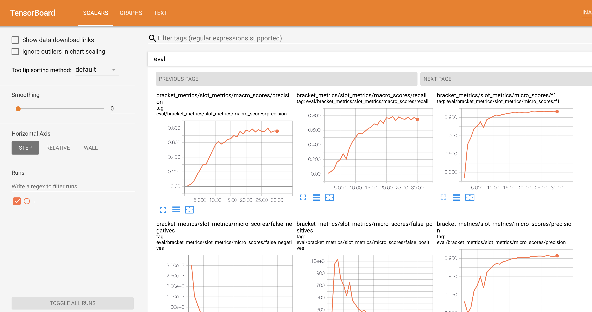
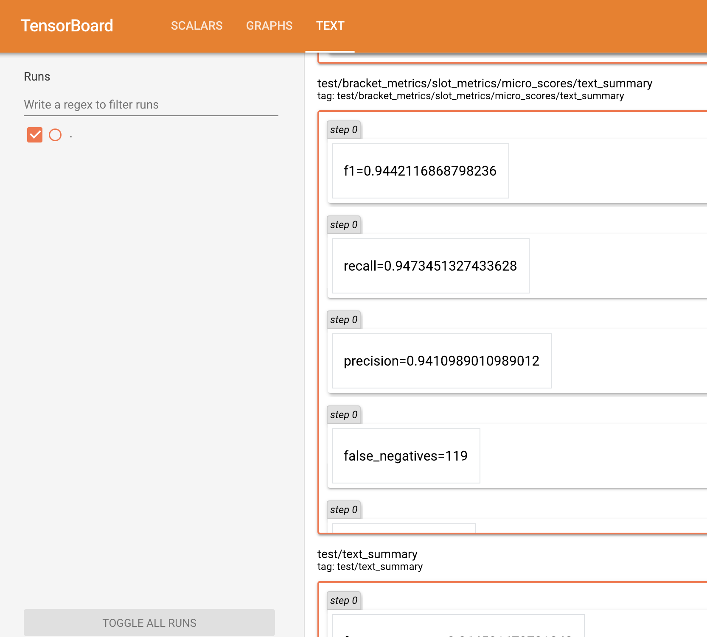
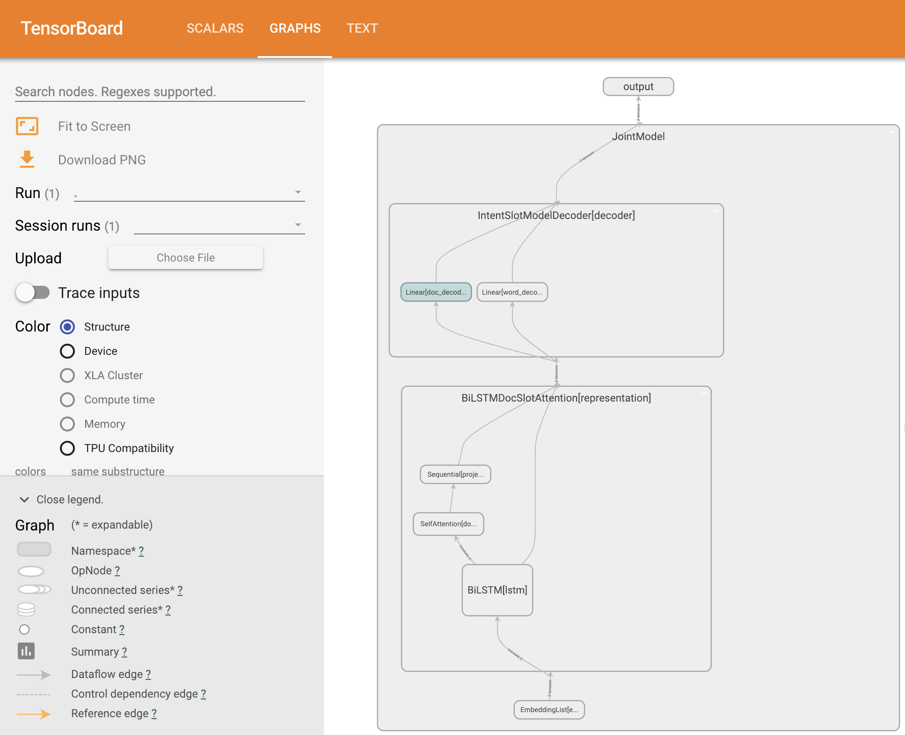

Visualize Model Training with TensorBoard
======================================================

Visualizations can be helpful in allowing you to better understand, debug and optimize your models during training.
By default, all models trained using PyText can be visualized using `TensorBoard <https://www.tensorflow.org/guide/summaries_and_tensorboard>`.

Here, we will explore how to visualize the model from the tutorial :doc:`atis_tutorial`.

1. Install TensorBoard visualization server
-----------------------------------------------

The TensorBoard web server is required to host your visualizations. To install it, run

.. code-block:: console

  $ pip install tensorboard

2. Verify TensorBoard events in current working directory
-------------------------------------------------------------

Complete the tutorial from :doc:`atis_tutorial` if you have not done so.
Once that is done, you should be able to see a TensorBoard events file in the working directory where you trained your model. The file path will be something like ``<WORKING_DIR>/runs/<DATETIME>_<MACHINE_NAME>/events.out.tfevents.<TIMESTAMP>.<MACHINE_NAME>``.

3. Launch the visualization server
--------------------------------------

To launch the visualization server, run:

.. code-block:: console

  $ tensorboard --logdir=$EVENTS_FOLDER

``$EVENTS_FOLDER`` is the folder containing the events file in 2., which is something like ``<WORKING_DIR>/runs/<DATETIME>_<MACHINE_NAME>``.

Note: The TensorBoard web server might fail to run might fail to run if TensorFlow is not installed. This dependency is not ideal, but if you see `ModuleNotFoundError: No module named 'tensorflow'` when running the above command, you can install TensorFlow using:

.. code-block:: console

  $ pip install tensorflow

4. View your visualizations
------------------------------

After launching the visualization server, you can view your visualizations in a web browser at `http://localhost:6006`.

PyText visualizes the training metrics as scalars, test metrics as texts, and also the shape of the neural network architecture graph. Below are some screenshots of what you will see:

**Training Metrics:**

**Test Metrics:**

**Model Graph:**

